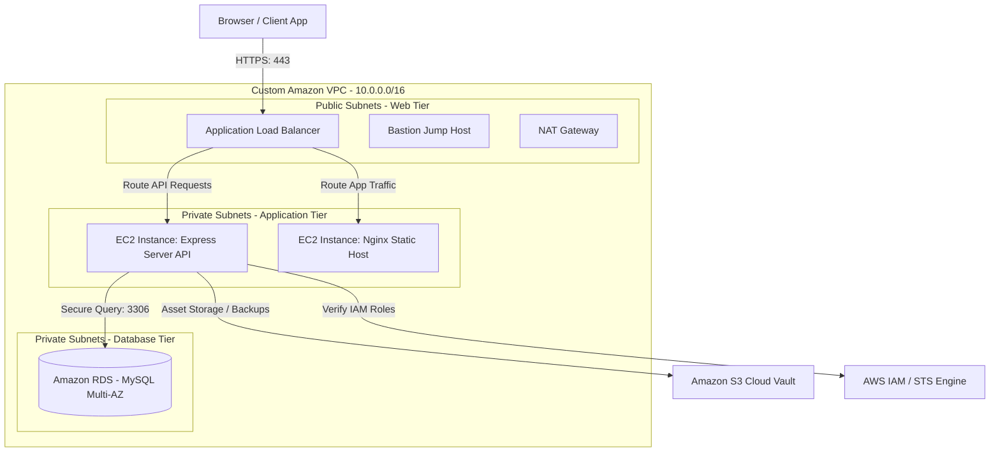

# EmpFlow — Cloud Architecture Specification

The system is deployed on AWS following secure enterprise-tier principles, fitting neatly inside the **AWS Free Tier** limits (t2.micro nodes, RDS db.t3.micro DB engines).

---

## 1. Cloud Architecture Topology (Mermaid Diagram)

---

## 2. Infrastructure Layer Breakdown

### Custom VPC Configuration
- **CIDR Block:** `10.0.0.0/16`
- **Subnets:**
  - `2x Public Subnets` (Internet-facing, hosts ALB and NAT Gateway)
  - `2x Private App Subnets` (Hosts application EC2 server instances)
  - `2x Private Data Subnets` (Isolated database group tier)
- **Internet Gateway (IGW):** Connects public subnets to the outer internet.
- **NAT Gateway:** Allows private application EC2 instances to fetch packages and updates from the internet securely, without exposing them to incoming external traffic.

### AWS Compute & Frontend Tier
- **Nginx Web Host (Public subnet proxy):** Serves compiled static React assets.
- **Express Backend Server:** Hosted on EC2 (Linux 2023), managed using PM2 daemon processes.
- **IAM Instance Profile:** Replaces hardcoded AWS credential keys. Utilizes AWS IAM role policies attached directly to the EC2 instances, granting secure programmatic read/write access to the S3 bucket.

### AWS RDS Database Layer
- **DB Engine:** MySQL Community Server 8.0.
- **Instance Class:** `db.t3.micro` (AWS Free Tier eligible).
- **Subnet Group:** Spans private subnets across two distinct Availability Zones (Multi-AZ fallback) for database high-availability.

### S3 Storage Vault
- **Usage:** Stores employee profile pictures (uploaded via backend multer-s3 middleware) and automated database backup files (`.sql` files).
- **ACL Policies:** Configured with specific public-read access controls for client asset rendering, while restricting writes exclusively to the EC2 security role.
